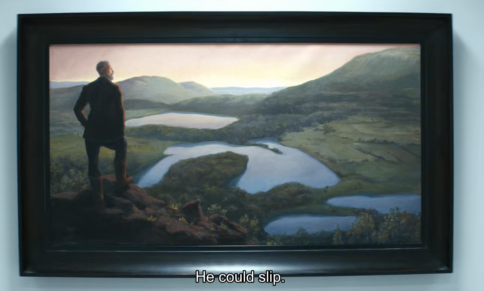

**摘要：** 本文探讨《人生切割术》（_Severance_）这部剧与德国浪漫主义画家**卡斯帕·大卫·弗里德里希**（Caspar David Friedrich）作品中共同的主题——**孤独与存在主义**。

## References

- [Walker, B. (2022). How Art Helps to Manipulate Minds in Severance](https://hyperallergic.com/747255/how-art-helps-to-manipulate-minds-in-severance/)