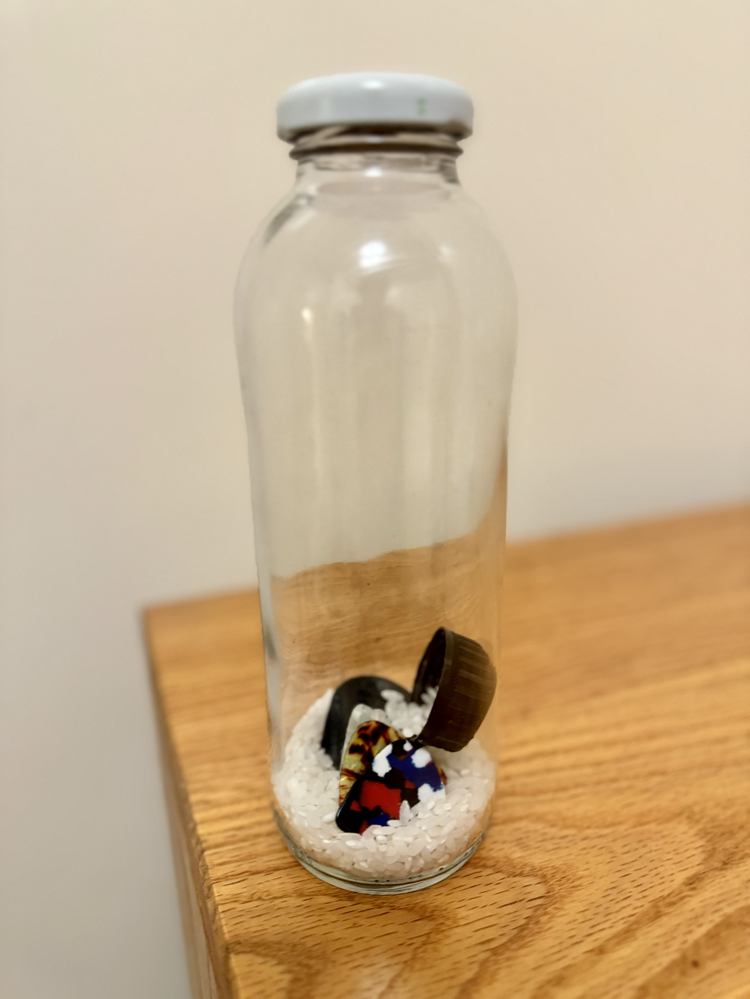

**My Instrument:**

Some rice, bottle caps, and guitar picks, inside a glass bottle.

**Group Member:**

David Wang, Luna Feng

**Requirement：**

Social: All people (musician or not) make their own instruments

World: Computers have been outlawed

Aesthetics: Surprising

Purpose: Big Collective Experience

**World View:** 

In a dystopian near-future, AI has been outlawed, but not before taking control of the human world, enslaving all of humanity. Despite the overwhelming dominance of machines, a secret resistance force fights to reclaim control. Under constant AI surveillance, traditional communication methods like language are too dangerous, as they can be easily detected and understood by the machines. However, AI is incapable of grasping art and music—things imbued with human emotion.

Recognizing this weakness, the resistance designs specialized instruments and uses them to create unique compositions, embedding coded messages within the music. Through these emotionally charged pieces, they communicate in secret, coordinating their efforts in the ongoing struggle to overcome the AI and reclaim their freedom. (Not all information is expressed without using existing languages. Only very important information, such as those expressing affirmation, negation, and various attitudes related to eliminating computers, is conveyed through this encrypted method.)

**Sound-Based Language System with Bottle Caps**

1. **_Speed of Shaking:_**

- **Fast shake**: Yes (Affirmative, agreement, or positive response)
- **Slow shake**: No (Negative response, disagreement)

2. **_Duration of Shaking:_**

- **Short shake (less than 2 seconds)**: Question (indicates a question or inquiry)
- **Long shake (more than 4 seconds)**: Emphasis (strengthens the message, like “definitely yes” or “strong no”)

3. **_Rhythmic Patterns:_**

- **Single shake**: Attention (used to alert the other person or begin a message)
- **Two quick shakes**: Stop (used to indicate an end of conversation or halt communication)
- **Three even shakes**: Go ahead (used to signal readiness or agreement to proceed)

4. **_Volume of Shaking:_**

- **Loud, strong shake**: Urgency (indicates something is urgent or needs immediate attention)
- **Soft, gentle shake**: Calm/Neutral (suggests calmness, non-urgent communication)

5. **_Combination Shakes_** (for more complex messages):

- **Fast shake + loud**: Affirmative but urgent (a yes with urgency)
- **Slow shake + soft**: Disagreement but non-urgent (a no but with a calm tone)
- **Fast shake + short duration + loud**: Asking an urgent question.

**Example Communication**

- **Fast, loud shake (Yes + Urgency)**: “We need to act immediately.”
- **Slow, soft shake (No + Calm)**: “There’s no rush, let’s wait.”
- **Single quick shake + Long shake (Attention + Strong no)**: “Stop now, it’s important.”

**Performance:**

**Ver 1 (Designed):**

**_Setting:_**A dimly lit underground hideout, where two resistance fighters secretly communicate under the threat of computers’ surveillance. They are both holding bottles with caps, which they use to shake in order to convey messages. Computer drones hover outside, scanning for any human communication.

**_Characters:_**

- **Resistance Fighter A (determined, cautious)**

- **Resistance Fighter B (anxious, but focused)**

**_Action Begins:_**

Resistance Fighter A hears a faint sound outside (drone whirring) and signals to Fighter B by performing one quick shake (Single shake: Attention).

Fighter B looks up, responding with three even shakes (Go ahead: ready to receive the message).

Fighter A begins shaking the bottle slowly and softly (No + Calm):  
Message: “The drones haven’t found us yet. We’re still safe.”

Fighter B, visibly anxious, shakes the bottle quickly but softly (Yes + Calm, but seeking confirmation):  
Message: “Do we have to act now?”

Fighter A immediately follows with a fast, loud shake (Yes + Urgency):  
Message: “Yes, we need to act immediately.”

Fighter B becomes more alert, shakes the bottle three times evenly (Go ahead):  
Message: “Ready to proceed.”

Fighter A notices a red flashing alert on the surveillance screen indicating an AI drone approaching their location, and immediately shakes the bottle twice quickly (Stop):

Message: “Wait, hold.”

Both characters hold their breath, staying still, waiting for the threat to pass.

After a tense moment, Fighter A shakes slowly and softly again (No + Calm):  
Message: “We’re safe for now. No need to act yet.”

Fighter B shakes gently and slowly in response (No + Calm):  
Message: “Agreed. Let’s wait.”

The scene ends as both fighters silently prepare for the next phase, waiting in the shadows, shaking their bottles only when absolutely necessary.

**Ver 2: To fit “Big Collective Experience” better**

Professor David suggested in class that instead of doing a performance with just two people, we could actually invite everyone to participate. This way, we can convey the message using different bottles but following the same language rule, which would make the performance more impressive and interesting.

